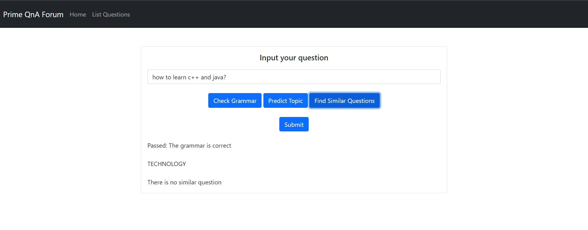
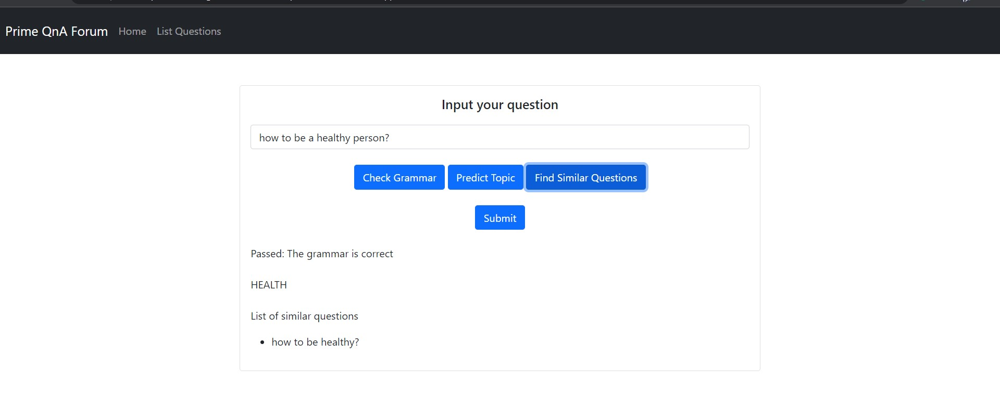
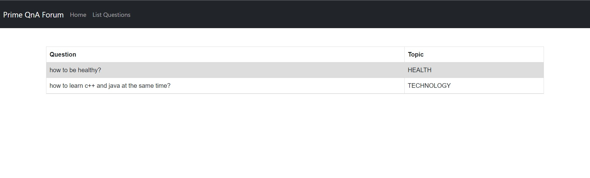

# Question Classifier WebApp
-------

Web application prototype for [Quora](https://quora.com)-like application, that can post question. But this repo is just the implementation of Machine Learning Systems that implement grammar corrector, question similarity checker, and topic classification, and then saving the data into SQLite.

## ML Modules
-------

1. Linguistic Acceptability - Taufiq Husada
2. Question Similarity - Naufal Prima Yoriko
3. Topic Classification - Fatkhan Masruri

The training codes and data link are saved in `ml-train` directory, while prediction functions that used in backend and trained model links are saved in `backend/ml` directory.

## Screenshots
------

Here are some screenshots of our app

- Question creation page

    

    

- Questions list page

    

## API Docs
------

The documentation of the app is written in `docs/api` directory, but formattted in *json*, and can be opened properly using **Postman** app. 

## Dependency
-------

1. Python

2. Libraries for ML
   1. TensorFlow
   2. PyTorch
   3. Transformers
   4. Numpy
   5. Pandas
   6. Matplotlib
   7. NLTK
   8. Keras

3. Libraries for Backend
   1. Django and it's supporting lib

4. jQuery (for frontend)

## How to Run

### Backend
-------

1. Navigate to `backend` directory
   
2. Install all dependency using pip with 
    ```
    pip install requirement.txt
    ```

3. Migrate (may be needed) the schema with
    ```
    python manage.py migrate
    ```

4. Run the server with 
    ```
    python manage.py runserver --noreload
    ```

### Frontend
-------

1. Host the static files in `frontend` dir, like using VSCode **live server** extension
   
2. Open `index.html` file from your browser, the app should be ready to use

## Collaborators
-------

- [Naufal Prima Yoriko](https://github.com/primayoriko) -  13518146
- [Taufiq Husada Daryanto](https://github.com/taufiqhusada) -  13518058
- Fatkhan Masruri -  13518053
 